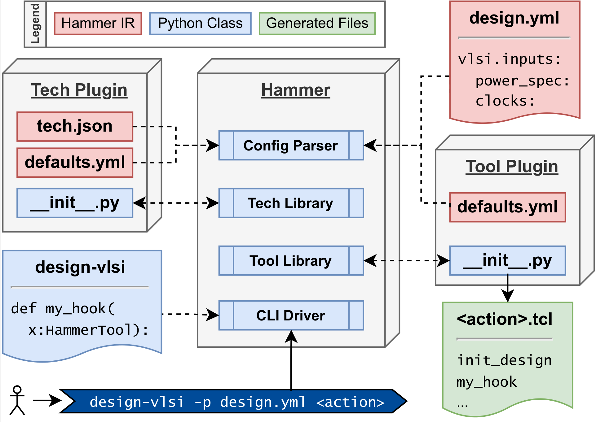

Hammer Overview
================================

Hammer has a set of actions and automatically takes the output of one action and converts it into the input for another.  For instance, a synthesis action will output a mapped verilog file which will then automatically by piped to the place-and-route input when a place-and-route action is called.

A user's Hammer environment is typically separated into four different components: core Hammer, one or more tool plugins, a technology plugin, and a set of project-specific Hammer input files. Hammer is meant to expose a set of generalized APIs that are then implemented by tool- and technology-specific plugins.

Hammer is included in a larger project called `Chipyard <https://github.com/ucb-bar/chipyard>`__ which is the unified repo for an entire RTL, simulation, emulation, and VLSI flow from Berkeley Architecture Research. There is an in-depth Hammer demo there, and it is a great place to look at a typical Hammer setup.

Main Hammer
-------------------------------

Hammer provides the Python backend for a Hammer project and exposes a set of APIs that are typical of modern VLSI flows. These APIs are then implemented by a tool plugin and a technology plugin of the designer's choice. The structure of Hammer is meant to enable re-use and portability between technologies.

Hammer takes its inputs and serializes its state in the form of YAML and JSON files. The designer sets a variety of settings in the form of keys in different namespaces that are designated in Hammer to control its functionality. These keys are contained in ``hammer/hammer/config/defaults.yml``. This file shows all of the keys that are a part of main Hammer and provides sensible defaults that may be overridden or are set to null if they must be provided by the designer.

Here is an example of a snippet that would be included in the user's input configuration.

.. _library-example:
.. code-block:: yaml

    vlsi.core.technology: "asap7"
    vlsi.inputs.supplies:
        VDD: "0.7 V"
        GND: "0 V"

This demonstrates two different namespaces, ``vlsi.core`` and ``vlsi.inputs``, and then two different keys, ``technology`` and ``supplies``, which are set to the ``asap7`` technology and 0.7 Volts supply voltage, respectively.

Further details about these keys and how they are manipulated is found in the :ref:`config` section.

Tech Plugins
-------------------------------

A techonology plugin consists of two or more files: a ``*.tech.json`` and a ``defaults.yml``.

The ``*.tech.json`` contains pointers to relevant PDK files and fundamental technology constants.  These values are not meant to be overriden, nor can they be for the time being.

``defaults.yml`` sets default technology variables for Hammer to consume, which may be specific to this technology or generic to all. These values may be overriden by design-specific configurations. An example of this is shown in the open-source technology plugins in ``hammer/technology/``, such as ``asap7``, and how to setup a technology plugin is documented in more detail in the :ref:`technology` section.

.. note:: Unless you are a UCB BAR or BWRC affiliate or have set up a 3-way technology NDA with us, we cannot share pre-built proprietary technology plugin repositories.

Tool Plugins
-------------------------------

A Hammer tool plugin actually implements tool-specific steps of the VLSI flow in Hammer in a template-like fashion.
The TCL commands input to the tool are created using technology and design settings provided by the designer.

There are currently three Hammer tool plugin repositories for commercial tools: ``hammer-cadence-plugins``, ``hammer-synopsys-plugins``, and ``hammer-mentor-plugins``. In them are tool plugin implementations for actions including synthesis, place-and-route, DRC, LVS, and simulation. ``hammer-cadence-plugins`` and ``hammer-synopsys-plugins`` are publicly available; however, users must request access to ``hammer-mentor-plugins``.

.. _plugins-access:
.. note:: If you are not a UCB BAR or BWRC affiliate and have access to Mentor Graphics (now Siemens) tools, please email hammer-plugins-access@lists.berkeley.edu with a request for access to the hammer-mentor-plugins repository. MAKE SURE TO INCLUDE YOUR GITHUB ID IN YOUR EMAIL AND YOUR ASSOCIATION TO SHOW YOU HAVE LICENSED ACCESS TO THE TOOLS. There will be no support guarantee for the plugin repositories, but users are encouraged to file issues and contribute patches where needed.

There are also a set of open-source tools (e.g. Yosys, OpenROAD, Magic, Netgen) provided in ``hammer/`` under their respective actions.

These plugins implement many of the common steps of a modern physical design flow. However, a real chip flow will require many custom settings and steps that may not be generalizable across technology nodes.
Because of this, Hammer has an "escape-hatch" mechanism, called a hook, that allows the designer to inject custom steps between the default steps provided by the CAD tool plugin.
Hooks are python methods that emit TCL code and may be inserted before or after an existing step or replace the step entirely.
This allows the designer to leverage the APIs built into Hammer while easily inserting custom steps into the flow.
Hooks are discussed in more detail in the "Example usage" portion of the Hammer documentation.

Calling Hammer
-------------------------------

To use Hammer on the command line, the designer will invoke the ``hammer-vlsi`` utility.
This is calling the ``__main__()`` method of the ``CLIDriver`` class. An example invocation is below:

.. _call-example:
.. code-block:: bash

    hammer-vlsi -e env.yml -p config.yml --obj_dir build par

Using hooks requires the designer to extend the ``CLIDriver`` class. A good example exists in the `Chipyard <https://github.com/ucb-bar/chipyard>`__ repository (``chipyard/vlsi/example-vlsi``). This would change the invocation to something like the following:

.. _call-example-hooks:
.. code-block:: bash

    example-vlsi -e env.yml -p config.yml --obj_dir build par

Hammer configuration files consist of environment and project configurations.
The environment configuration file, which in this case is ``env.yml``, is passed to Hammer using the ``-e`` flag.
``env.yml`` contains pointers to the required tool licenses and environment variables.

Any number of other YML or JSON files can then be passed in using the ``-p`` flag.
In this case, there is only one, ``config.yml``, and it needs to set all the required keys for the step of the flow being run.
Passing in multiple files looks like ``-p config1.yml -p config2.yml``. Refer to the :ref:`config` section for the implications of multiple config files.

The environment settings take precedence over all project configurations, 
and are not propagated to the output configuration files after each action.
The order of precedence for the project configs reads from right to left (i.e. each file overrides all files to its left in the command line).

``--obj_dir build`` designates what directory Hammer should use as a working directory.
All default action run directories and output files will be placed here.

Finally, ``par`` designates that this is a place-and-route action.

In this case, Hammer will write outputs to the path ``$PWD/build/par-rundir``.

For the full list of Hammer command-line arguments, run `hammer-vlsi --help` or take a peek in the ``hammer/vlsi/cli_driver.py`` file.

Summary
-------

The software architecture as described above is shown in the diagram below, which is taken from `the Hammer DAC paper <https://dl.acm.org/doi/abs/10.1145/3489517.3530672>`_.

