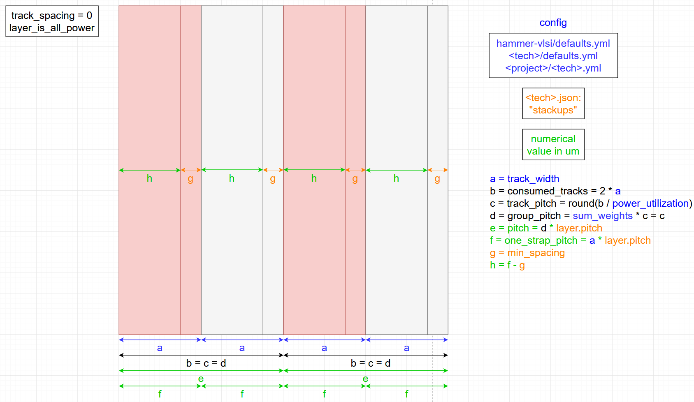
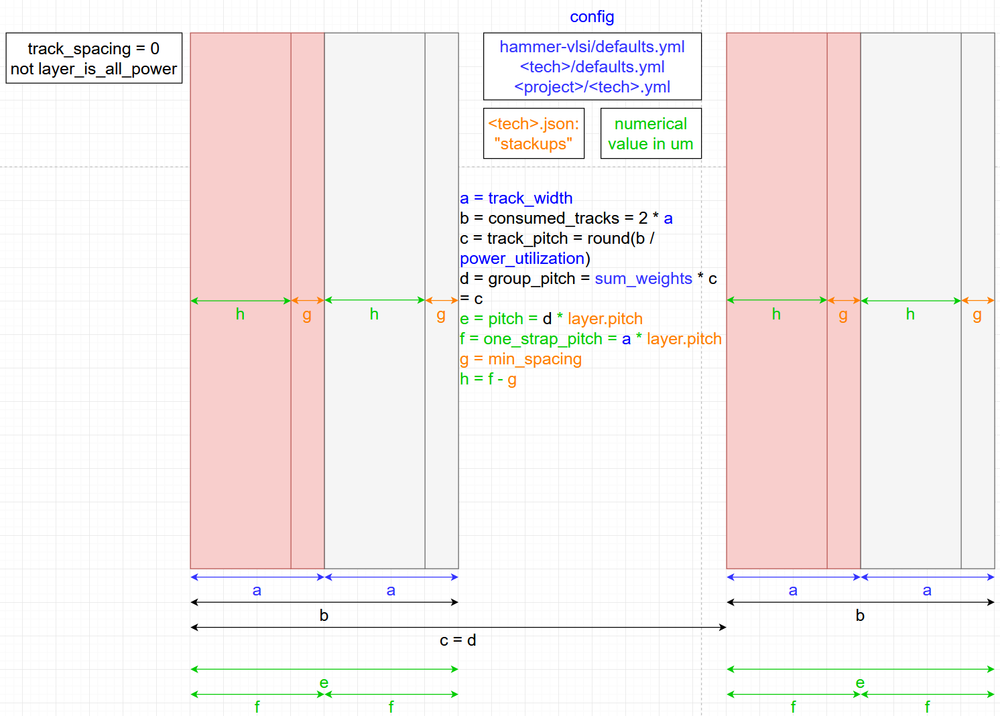
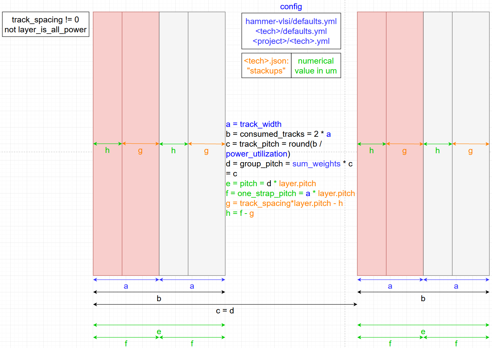

.. _hammer-apis:

Hammer APIs
===========

Hammer has a growing collection of APIs that use objects defined by the technology plugin, such as stackups and special cells. They expose useful extracted information from Hammer IR to other methods, such as in tool plugins that will implement this information in a tool-compatible manner.

For syntax details about the Hammer IR needed to use these APIs, refer to the `defaults.yml <https://github.com/ucb-bar/hammer/blob/master/hammer/config/defaults.yml>`__.

Power Specification
-------------------
Simple power specs are specified using the Hammer IR key ``vlsi.inputs.supplies``, which is then translated into a a Supply object. ``hammer_vlsi_impl`` exposes the Supply objects to other APIs (e.g. power straps) and can generate the CPF/UPF files depending on which specification the tools support. Multi-mode multi-corner (MMMC) setups are also available by setting ``vlsi.inputs.mmmc_corners`` and manual power spec definitions are supported by setting the relevant ``vlsi.inputs.power_spec...`` keys.

Power Domains
-------------
Hammer supports rudimentary intents for multiple power domains.
Physical domains can be specified as a specific instance of a ``placement_constraint``.
Furthermore, existing placement constraints can be repurposed as a power domain by setting the ``power_domain`` key.

In order to connect the supplies to the power domains, the ``power`` and ``ground`` supply nets must be linked to a specific power domain and assigned a voltage level.
There can only be *one* element in the ``ground`` list of supplies.

.. code-block:: yaml

    supplies:
      power: [
        {name: AO, pins: [VDD], domain: "AO", voltage: "0.85 V"},
        {name: A, pins: [A], domain: "A", voltage: "0.45 V"},
        {name: B, pins: [B], domain: "B", voltage: "0.5 V"},
      ]
      ground: [{name: VSS, pins: [VSS], voltage: "0 V"}]

Timing Constraints
------------------
Clock and pin timing constraints are specified using the Hammer IR keys ``vlsi.inputs.clocks/output_loads/delays``. These objects can be turned into SDC-style constraints by ``hammer_vlsi_impl`` for consumption by supported tools.

Floorplan & Placement
---------------------
Placement constraints are specified using the Hammer IR key ``vlsi.inputs.placement_constraints``. These constraints are very flexible and have varying inputs based on the type of object the constraint applies to, such as hierarchical modules, hard macros, or obstructions. At minimum, an ``(x, y)`` coordinate corresponding to the lower left corner must be given, and additional parameters such as width/height, margins, layers, or orientation are needed depending on the type of constraint. Place-and-route tool plugins will take this information and emit the appropriate commands during floorplanning. Additional work is planned to ensure that floorplans are always legal (i.e. on grid, non-overlapping, etc.).

All Hammer tool instances have access to a method that can produce graphical visualization of the floorplan as an SVG file, viewable in a web browser. To use it, call the ``generate_visualization()`` method from any custom hook (see :ref:`hooks`). The options for the visualization tool are in the Hammer IR key ``vlsi.inputs.visualization``.

Bumps
-----
Bump constraints are specified using the Hammer IR key ``vlsi.inputs.bumps``. Rectangular-gridded bumps are supported, although bumps at fractional coordinates in the grid and deleted bumps are allowed. The place-and-route tool plugin translates the list of bump assignments into the appropriate commands to place them in the floorplan and enable flip-chip routing. The bumps API is also used by the PCB plugin to emit the collateral needed by PCB layout tools such as Altium Designer. This API ensures that the bumps are always in correspondence between the chip and PCB.

The visualization tool mentioned above can also display bump placement and assignments. There are options to view the bumps from the perspective of the ASIC designer or the PCB designer. The views are distinguishable by a reference dot displayed in the left and right corners for the ASIC and PCB perspectives, respectively.

Pins
----
Pin constraints are specified using the Hammer IR key ``vlsi.inputs.pin``. PinAssignments objects are generated and passed to the place-and-route tool to place pins along specified block edges on specified metal layers. Preplaced (e.g. hard macros in hierarchical blocks) pins are also supported so that they are not routed. Additional work is planned to use this API in conjunction with the placement constraints API to allow for abutment of hierarchical blocks, which requires pins to be aligned on abutting edges.

Power Straps
------------
Power strap constraints are specified using multiple Hammer IR keys in the ``par`` namespace.You can find the keys in <tech>/defaults.yml under the tech plugin directory. An example from `asap7 <https://github.com/ucb-bar/hammer/blob/master/hammer/technology/asap7/defaults.yml>`__ is as follows:

.. literalinclude:: ../../hammer/technology/asap7/defaults.yml
   :language: yaml
   :linenos:
   :lines: 60-81
   :caption: ASAP7 default power straps setting
..

The default keys for all hammer configs are defined in the `defaults.yml <https://github.com/ucb-bar/hammer/blob/master/hammer/config/defaults.yml>`__, which contains detailed comments on what each key does. Here is the default setting and parameter descriptions for power strap generation.

.. literalinclude:: ../../hammer/config/defaults.yml
   :language: yaml
   :linenos:
   :lines: 572-610
   :caption: Hammer global default power straps setting
..

The currently supported API supports power strap generation by tracks, which auto-calculates power strap width, spacing, set-to-set distance, and offsets based on basic DRC rules specified in the technology Stackup object. 

The technology Stackup information (“stackups”) can be found in the <tech>.tech.json file under the tech plugin directory. The “stackups” usually are located near the end of the <tech> ``.tech.json`` file. An example from `asap7 <(https://github.com/ucb-bar/hammer/blob/master/hammer/technology/asap7/asap7.tech.json>`__ is as follows:

.. literalinclude:: ../../hammer/technology/asap7/asap7.tech.json
   :language: json
   :linenos:
   :lines: 1364-1381
   :caption: ASAP7 stackup object
..

The keys in the Stackup object are defined in `stackup.py <https://github.com/ucb-bar/hammer/blob/master/hammer/tech/stackup.py>`__ as follows.

.. literalinclude:: ../../hammer/tech/stackup.py
   :language: none
   :linenos:
   :lines: 79-98
   :caption: Description for a metal layer/stackup
..

The basic pieces of information needed are the desired track utilization per strap and overall power strap density. Powerstraps are routed in pairs of Vdd and Vss. Based on the effective power utilization and track spacing, there are three ways to route powerstraps.

For track spacing = 0 and effective power utilization = 100%, powerstraps are routed as follows.

For track spacing = 0 and effective power utilization < 100%, powerstraps are routed as follows.

For track spacing > 0 and effective power utilization < 100%, powerstraps are routed as follows.

The currently supported API supports power strap generation by tracks, which auto-calculates power strap width, spacing, set-to-set distance, and offsets based on basic DRC rules specified in the technology Stackup object. The basic pieces of information needed are the desired track utilization per strap and overall power strap density. Different values can be specified on a layer-by-layer basis by appending ``_<layer name>`` to the end of the desired option.

Special Cells
-------------
Special cells are specified in the technology's JSON, but are exposed to provide lists of cells needed for certain steps, such as for fill, well taps, and more. Synthesis and place-and-route tool plugins can grab the appropriate type of special cell for the relevant steps.

Submission
----------
Each tool has run submission options given by the Hammer IR key ``<tool type>.submit``. Using the ``command`` and ``settings`` keys, a setup for LSF or similar workload management platforms can be standardized.
