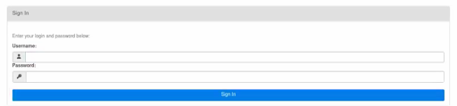
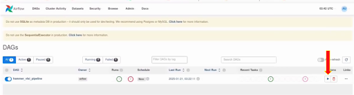
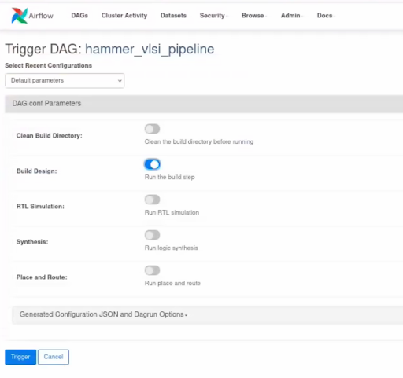

For each user running their own airflow standalone server


1. ssh [username@bwrcix-3.eecs.berkeley.edu](mailto:username@bwrcix-3.eecs.berkeley.edu)
2. Tool installation
    1. Conda
        1. Install Miniforge/conda

            ```
            wget -O Miniforge3.sh "https://github.com/conda-forge/miniforge/releases/latest/download/Miniforge3-$(uname)-$(uname -m).sh"
            bash Miniforge3.sh -p "/bwrcq/C/username/conda"
            ```


        2. Make sure the followings are in ~/.bashrc to have conda initialized 

            ```
             # >>> conda initialize >>>
             # !! Contents within this block are managed by 'conda init' !!
             __conda_setup="$('/bwrcq/C/username/conda/bin/conda' 'shell.bash' 'hook' 2> /dev/null)"
             if [ $? -eq 0 ]; then
                 eval "$__conda_setup"
             else
                 if [ -f "/bwrcq/C/username/conda/etc/profile.d/conda.sh" ]; then
                     . "/bwrcq/C/username/conda/etc/profile.d/conda.sh"
                 else
                     export PATH="/bwrcq/C/username/conda/bin:$PATH"
                 fi
             fi
             unset __conda_setup
             # <<< conda initialize <<<
            ```


    2. Setup poetry 1.8.3
        3. Vim ~/setup.sh
        4. Add the followings to this setup.sh and save

            ```
            curl -sSL https://install.python-poetry.org | python3 - --version 1.8.3

            poetry config virtualenvs.in-project true
            poetry install

            poetry shell
            ```


    3. Airflow
        5. Vim ~/airflow.sh
        6. Add the followings to this airflow.sh and run it

            ```
            AIRFLOW_VERSION=2.9.0

            # Extract the version of Python you have installed. If you're currently using a Python version that is not supported by Airflow, you may want to set this manually.
            # See above for supported versions.
            PYTHON_VERSION="$(python -c 'import sys; print(f"{sys.version_info.major}.{sys.version_info.minor}")')"

            CONSTRAINT_URL="https://raw.githubusercontent.com/apache/airflow/constraints-${AIRFLOW_VERSION}/constraints-${PYTHON_VERSION}.txt"
            # For example this would install 2.10.2 with python 3.8: https://raw.githubusercontent.com/apache/airflow/constraints-2.10.2/constraints-3.8.txt

            pip install "apache-airflow==${AIRFLOW_VERSION}" --constraint "${CONSTRAINT_URL}"
            ```


3. In /bwrcq/C/username/: source ~/.bashrc
4. In /bwrcq/C/username: source setup.sh ← This is from step &lt;2b>
5. [only first time, creates an account] 

    In /bwrcq/C/username/hammer/e2e: airflow users create -r User [-u USERNAME] [-e EMAIL] [-f FIRSTNAME] [-l LASTNAME] [-p PASSWORD]

6. In /bwrcq/C/username/hammer/e2e: airflow standalone
7. Open on browser: bwrcix-3.eecs.berkeley.edu:&lt;ip_port>/home
    4. Ip_port is default at 8080 and can be configured in ~/airflow/airflow.cfg

Common problems


* Incompatible versions:
    * Working as of 2/17/25: Please refer to installation step &lt;2b> and &lt;2c> for adjustments on poetry, python and airflow version
        * Python 3.8.12
        * Poetry 1.8.3
        * Hammer version: 3.9.4
        * Airflow 2.9.0 (Git Version: .release:50f22ffe9150e93f7fc08a9dc8a48880daad374b)
* Sim-rtl not working: 
    * cp /bwrcq/C/isabellehsu/eecs151_labs/hammer_cache_files/* /bwrcq/C/isabellehsu/hammer/e2e/build-sky130-cm/gcd/tech-sky130-cache/

To run flow:


1. Setup the DAG
    1. Pull the latest airflow branch from Hammer github repo
    2. Make sure the airflow is pointing to the sledgehammer DAG by 
        1. Open ~/airflow/airflow.cfg
        2. Edit the variable “dags_folder”, make sure it points to hammer/shell directory inside your new hammer git pulled directory
2. Login with credentials entered when the user was created




3. Press the ▶ symbol to trigger the hammer_vlsi_pipeline DAG (Directly Acyclic Graph) 




4. This should popup automatically. Choose what you want to run. Then click “Trigger” on the bottom left.

    



